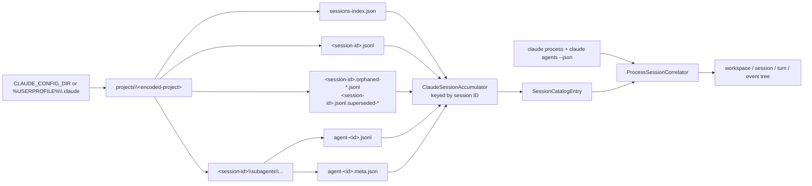
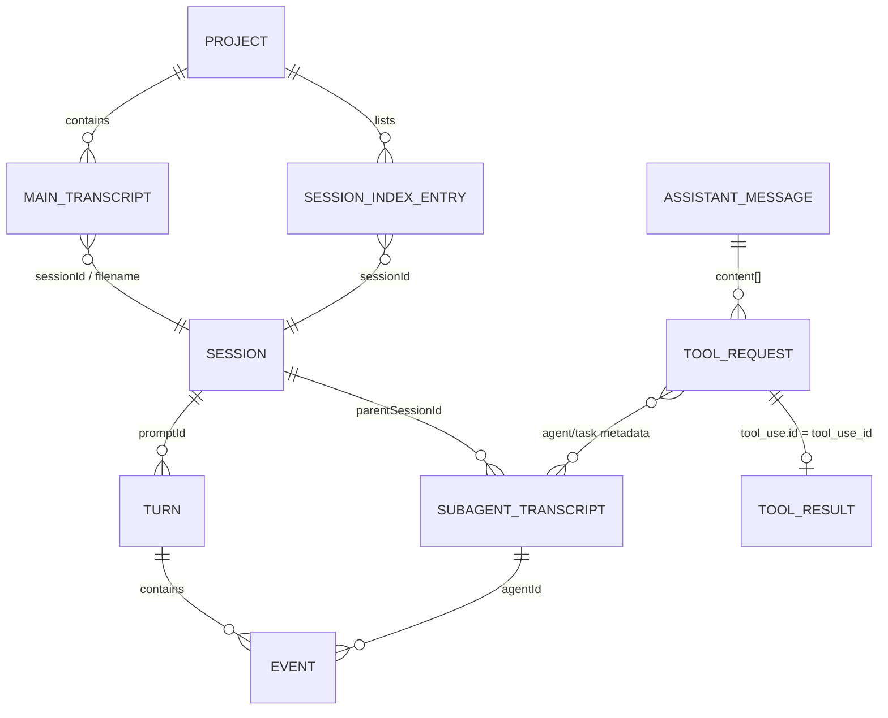
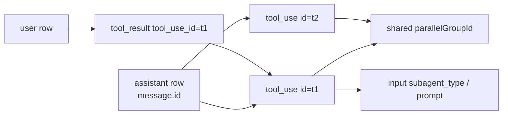
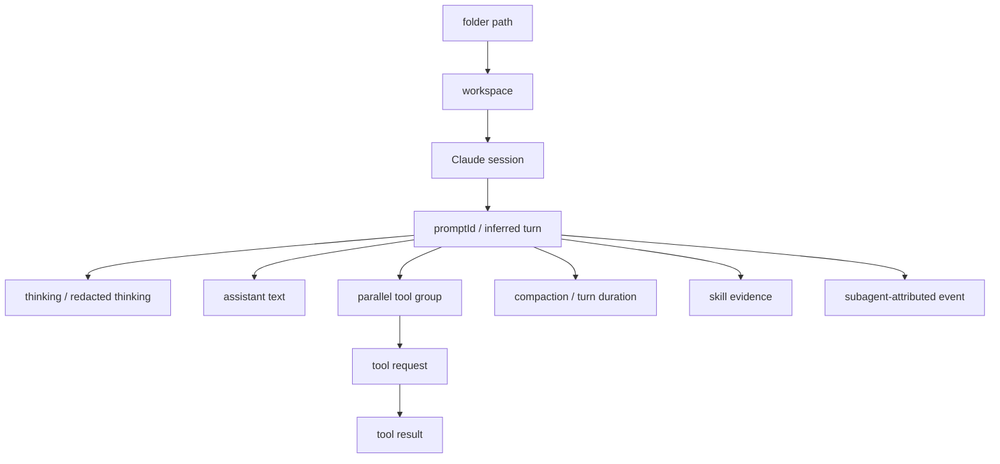

# SessionViewer: Claude Code sessions

Implementation snapshot: 2026-09-06.

This document describes the current file-backed Claude Code catalog used by
`SessionViewer`. It does not describe Claude Desktop, Cowork, claude.ai chat,
or Managed Agents. SessionViewer does not require Claude hooks or a Claude
Agent SDK sidecar and does not resume a session while refreshing.

The hook-side transcript enrichment contract remains separate:
[`Transcripts_Claude.md`](../src/Transcripts_Claude.md).
SessionViewer does not use `ObservationReconciler`; that class belongs to the
hook/transcript enrichment pipeline documented in
[`architecture.md`](../src/architecture.md#transcript-source-implemented).

## Current scope

SessionViewer reconstructs one Claude catalog entry from:

- a project-level `sessions-index.json` entry, when available;
- the normal main session JSONL;
- recoverable orphaned/superseded main JSONL;
- recursively discovered subagent JSONL;
- subagent `.meta.json` relationship metadata;
- optional current-process evidence.



## Configuration root and source locations

The root is:

```text
%USERPROFILE%\.claude
```

If `CLAUDE_CONFIG_DIR` is set, it replaces the whole root. SessionViewer
expands Windows environment variables and supports `~`, `~/...`, and `~\...`.

| Source | Path below the root | What SessionViewer uses |
|---|---|---|
| Session index | `projects\<encoded-project>\sessions-index.json` | Session identity, title/summary, first prompt, times, branch, project path, transcript path, arbitrary index metadata |
| Main transcript | `projects\<encoded-project>\<session-id>.jsonl` | Prompts, assistant content, tools/results, usage, mode, model, titles, cost state, compaction, provenance |
| Orphan recovery | `projects\<encoded-project>\<session-id>.orphaned-*.jsonl` | Recoverable main-session history |
| Superseded recovery | `projects\<encoded-project>\<session-id>.jsonl.superseded-*` | Recoverable earlier main-session history |
| Subagent transcript | `projects\<encoded-project>\<session-id>\subagents\...\*.jsonl` | Child-agent content, IDs, turns, tools, usage |
| Subagent metadata | `projects\<encoded-project>\<session-id>\subagents\...\*.meta.json` | Agent metadata and parent `toolUseId` provenance |
| Live agents | `claude agents --json` and process command lines | Session ID, transcript path, CWD, PID, positive open-state evidence |

SessionViewer does **not** currently read `.claude\history.jsonl`,
`stats-cache.json`, file history, plans, tasks, debug logs, or Agent SDK
session APIs. Those files may exist but are not catalog sources.

The project tree is watched recursively. Changes to `.jsonl` and
`sessions-index.json` trigger an immediate provider refresh after a 450 ms
debounce. Other files, including subagent `.meta.json`, are picked up by the
recovery scan that runs every 60 seconds by default. The harness filter is
applied after discovery, so hiding Claude does not disable its scanner.

### Tips for reliable discovery

- Run SessionViewer under the same Windows account and environment as Claude
  Code. If Claude uses `CLAUDE_CONFIG_DIR`, SessionViewer must inherit it.
- Main/subagent files are opened with read/write/delete sharing, allowing reads
  while Claude appends or removes them.
- Subagent files can be short-lived. SessionViewer can only show a file that
  still exists when scanning begins; the hook-side durable capture pipeline is
  the mechanism for preserving files that Claude deletes before a later scan.
- Reparse-point project/session directories are skipped. This prevents
  unbounded traversal but means a symlinked `projects` tree is unsupported.
- `sessions-index.json` is an accelerator and metadata source, not the detail
  authority. A session can still be built from JSONL when the index is absent.
- Recovery files are read in addition to the normal file and merged by stable
  event/turn IDs. They are not assumed to be complete or newer.

## Effective safety limits

SessionViewer disables the directory-count, file-count, and overall
scan-duration limits. It retains bounded parsing:

| Limit | Effective value | Claude behavior |
|---|---:|---|
| Records per parent session | 250,000 across main, recovery, and subagents | Further records are not read; result is incomplete |
| JSONL line size | 16 MiB | Oversized row is skipped |
| JSONL file prefix | 2 GiB | Only the prefix is inspected |
| JSON/metadata file | 2 GiB and `int.MaxValue` | Oversized index/meta file is skipped |
| JSON nesting depth | 128 | Deeper/malformed rows are skipped |

Malformed rows do not abort the whole catalog. Warnings and `IsComplete=false`
make data loss visible.

## `sessions-index.json` format

The index root must be an object:

```json
{
  "version": 1,
  "originalPath": "C:\\repo",
  "entries": [
    {
      "sessionId": "session-uuid",
      "fullPath": "C:\\Users\\me\\.claude\\projects\\C--repo\\session-uuid.jsonl",
      "firstPrompt": "run the tests",
      "summary": "Run test suite",
      "messageCount": 12,
      "created": "2026-09-05T08:00:00Z",
      "modified": "2026-09-05T08:05:00Z",
      "gitBranch": "main",
      "projectPath": "C:\\repo",
      "isSidechain": false
    }
  ]
}
```

| Field | Accepted aliases/shapes | Extraction |
|---|---|---|
| `version` | string, number, or Boolean scalar | Provenance contract version and metadata |
| `originalPath` | `original_path` | Preferred workspace candidate |
| `entries[]` | array of objects | Session metadata |
| `sessionId` | `session_id`; required | Accumulator/catalog identity |
| `fullPath` | `full_path` | Verifies that index metadata belongs to the discovered main file |
| `firstPrompt` | `first_prompt` | Title/prompt fallback |
| `summary` | `title` | Preferred index title |
| `messageCount` | `message_count`; number or numeric string | Preserved metadata |
| `created` | `createdAt`, `created_at`; ISO or epoch | Start candidate |
| `modified` | `updatedAt`, `updated_at`; ISO or epoch | Last-activity candidate |
| `fileMtime` | `file_mtime`, `mtime`; seconds or milliseconds | Last-activity fallback |
| `gitBranch` | `git_branch` | Preserved metadata |
| `projectPath` | `project_path`, `cwd` | Workspace candidate |
| `isSidechain` | `is_sidechain`; Boolean/string | Sidechain index entries are skipped |

All entry properties are also preserved under `claude.index.<name>`.

## Transcript JSONL format

Each non-empty UTF-8 line must be a JSON object. The reader accepts a BOM,
trailing commas, comments, and a valid final line without `\n`.

### Common row fields

| Field | Meaning and use |
|---|---|
| `type` | Dispatches the row family |
| `sessionId` / `session_id` | Session identity and conflict detection |
| `promptId` / `prompt_id` | Exact turn identity when present |
| `uuid` | Native record identity |
| `parentUuid` / `parent_uuid` | Chronological/source chain, not tree nesting |
| `timestamp`, `createdAt`, `created_at` | Event chronology |
| `cwd` | Workspace candidate; main transcript outranks subagent CWD |
| `gitBranch`, `version`, `entrypoint`, `slug` | Session metadata |
| `permissionMode`, `mode` | Mode metadata |
| `agentId`, `agentType`, attribution fields | Subagent and skill/tool attribution |
| `message` | Assistant/user content and usage |

### Row families

| `type` | Important content | SessionViewer result |
|---|---|---|
| `user` | `message.content` text or `tool_result`; optional `toolUseResult` | Human prompt and/or tool result |
| `assistant` | `message.model`, `message.id`, `message.content[]`, `message.usage` | Thinking, text, tool requests, unknown assistant blocks, usage |
| `system` + `subtype:"turn_duration"` | `durationMs` | Turn-stop event |
| `system` + `subtype:"compact_boundary"` | content and `compactMetadata.durationMs` | Compaction-completed event |
| other `system` | arbitrary | Raw session metadata/provenance |
| `attachment` + `skill_listing` | skill arrays/content | `Available` skill evidence |
| `attachment` + `skill_activated` | skill arrays/content | `Invoked` skill evidence |
| other `attachment` | arbitrary | Raw session metadata/provenance |
| `mode`, `permission-mode` | current mode | Session mode; permission mode wins |
| `ai-title`, `custom-title`, `agent-name`, `last-prompt` | title/prompt values | Session title and metadata |
| `cost-state` | cumulative totals and `modelUsage` | Latest main-file snapshot only |
| `fork-context-ref` | parent session/UUID/agent | Subagent lineage metadata |
| any other type | arbitrary | Preserved as `claude.raw...` metadata and source provenance |

### Assistant content blocks

| Block | Important fields | Event |
|---|---|---|
| `thinking` | `thinking`, `signature` | Readable thought or opaque thought |
| `redacted_thinking` | optional signature | Opaque thought |
| `text` | `text` | Agent response |
| `tool_use` | `id`, `name`, `input`, MCP/skill attribution | Tool request; a `Skill` tool carries `Invoked` skill evidence (see [Skills](#skills)) |
| unknown | `text`/`content` when available | Provider-specific message |

### User content blocks

| Block | Important fields | Event |
|---|---|---|
| `text` | `text` | Human prompt if not `isMeta` and not merely a tool-result carrier |
| `tool_result` | `tool_use_id`, content, error/interruption state | Tool success/failure |

`toolUseResult` at row level can contain structured stdout, stderr, errors,
files, diffs, and interruption data. It is preferred when the block's content
does not provide useful result text.

## Session, turn, tool, and subagent relationships



SessionViewer has no separate `Run` entity. Claude's `promptId` becomes a
`SessionTurn`; `message.id` becomes `AssistantStepId`; and `tool_use.id`
identifies the tool operation within that model step.

### Session identity

1. Index entries are keyed by `sessionId`; sidechain index entries are ignored.
2. A main filename supplies a fallback identity.
3. If all rows expose one consistent `sessionId`, that ID replaces the
   filename fallback.
4. Conflicting row IDs retain the filename identity and produce metadata/
   warnings rather than joining potentially unrelated sessions.
5. A subagent row uses `parentSessionId`, then `sessionId`, then its containing
   session directory as the parent. Agent identity comes from row `agentId` or
   the `agent-<id>` filename.
6. Catalog identity is
   `ClaudeCode:ClaudeCode:<native-session-id>`.

Index, main, recovery, subagent, and metadata evidence for that identity enter
one `ClaudeSessionAccumulator`.

### Workspace resolution

Workspace is selected in this order:

1. an index `originalPath`, then index `projectPath`, but only when the index
   `fullPath` is compatible with the discovered main transcript;
2. a successfully decoded `<encoded-project>` path whose directories exist;
3. CWD from the normal main transcript;
4. CWD from a recovery main transcript;
5. subagent CWD;
6. `Unknown workspace`.

This prevents a subagent that changes directory from redefining its parent
session's workspace.

### Title, model, mode, and time

Title candidates have explicit priority:

```text
custom-title > ai-title > agent-name > index summary >
index firstPrompt > transcript first prompt > session ID
```

Normal main JSONL outranks recovery JSONL, which outranks subagent content for
first-prompt, model, mode, and permission-mode candidates. `permissionMode`
becomes the displayed mode when available.

Session start/last activity use transcript timestamps plus index timestamps.
Turn timestamps are used when session-level values are absent; file
modification time is the final last-activity fallback.

### Turn construction

- A human `user` text row starts/identifies a turn.
- Native `promptId` is `Observed`. A missing prompt ID becomes
  `inferred:<record-id-or-hash>` with `Derived` evidence.
- Assistant and system rows lacking `promptId` inherit the last unambiguous
  prompt ID in the same transcript.
- Events that still cannot be scoped use `agent:<agentId>:unscoped` or
  `session:<sessionId>:unscoped`.
- Turns are ordered by first timestamp, then first source order, and numbered
  after accumulation.
- `uuid`/`parentUuid` are retained as provenance links but do not create nested
  tree nodes.

### Tool and parallel-call binding



- `tool_use.id` is stored as `ToolCallId`; `tool_result.tool_use_id` joins
  exactly to it. The tree nests a result below the nearest earlier request.
- Tool names learned from requests are reused when a result omits its name.
- Multiple `tool_use` blocks in one assistant message share a generated
  `ParallelGroupId` and are displayed below one parallel group.
- Native names are retained and also classified into canonical categories.
- Names beginning `mcp__<server>__<tool>` are split at the first double
  separator. Explicit `attributionMcpServer`/`attributionMcpTool` overrides
  that fallback.
- `input.subagent_type`/`agent_type` and
  `input.prompt`/`description`/`task` populate `AgentType` and `Task`. The
  child transcript's `agentId` remains separate evidence; the implementation
  does not invent an exact tool-to-child join when no common native ID exists.

### Skills

Skill evidence is captured from three independent signals, and each keeps its
source path so an offered skill is never shown as one that ran:

- A `Skill` **tool request** — a `tool_use` whose `name` is `Skill` and whose
  `input.skill` (or `skillName`/`skill_name`) names the activated skill — yields
  `Invoked` skill evidence directly on that tool node. This is authoritative and
  does **not** require a preceding `SKILL.md` read, which Claude does not always
  emit, so a skill invoked purely through the `Skill` tool is now detected.
- Any other tool falls back to `attributionSkill`/`skill` attribution fields
  carried on the block, message, or row (`Invoked`).
- `skill_listing` and `skill_activated` attachments contribute `Available` and
  `Invoked` evidence for the skills they name.

Nodes carrying skill evidence are rendered in bold italic indigo in the tree as
a lightweight visual hint, and the session/turn dashboards list the distinct
skill names.

### Thinking

Readable `thinking` is `Observed`. Empty thinking with a signature, and every
`redacted_thinking` block, is `Opaque`; signatures are retained only in raw
provenance and are never decoded.

### Usage and cost-state

Assistant `message.usage` becomes typed measurements:

| Native measurement | Scope | Behavior |
|---|---|---|
| `input_tokens` | Turn | Cumulative snapshot |
| `cache_read_input_tokens` | Turn | Cumulative snapshot |
| `cache_creation_input_tokens` | Turn | Cumulative snapshot |
| `output_tokens` | Turn | Delta |
| `output_tokens_details.thinking_tokens` | Turn | Delta |
| `server_tool_use.*` | Turn | Delta requests |

Repeated usage is deduplicated by assistant message ID plus the raw usage
object. Measurements are attached to the first projected content block in that
assistant row, or to a synthetic hidden usage event when no content exists.

Only the newest valid main-transcript `cost-state` is projected. It can add
session-final snapshots for API/tool/total duration, lines added/removed,
`totalCostUSD` converted to integer `micro-usd`, and per-model token/cache/web
search values. Recovery snapshots lose ties to normal-main snapshots.

For each token family, the dashboard uses the maximum non-delta snapshot when
one exists; only when no snapshot exists does it sum deltas. It therefore does
not sum every propagated cumulative row.

### Subagent data

- Subagent JSONL is merged into the parent session, not emitted as an
  independent top-level catalog session.
- Its file binding records `Role=Subagent`, `AgentId`, and `ParentSessionId`.
- Projected events carry `AgentId` and any provider attribution for agent type.
- `.meta.json` fields are preserved under
  `claude.subagent.<agent-id>.<field>`. The metadata's `toolUseId` is kept as
  provenance `ParentRecordId`.
- Nested directories below `subagents` are scanned recursively, including
  workflow layouts.

## Final open/closed state and opening

Claude catalog builders start sessions as `Closed`. Before publishing each
catalog update, SessionViewer combines:

- command-line hints from `claude` processes;
- `claude agents --json` (three-second timeout);
- exact session ID or transcript-path matches;
- a unique same-workspace/CWD match as a heuristic.

Exact `claude agents --json` IDs are `Observed`; unique workspace correlation
is `Heuristic`. File recency does not mark a session open.

**Open Session** uses the VS Code URI
`vscode://anthropic.claude-code/open?session=<id>` when `entrypoint` metadata
contains `vscode`; otherwise it launches a terminal with
`claude --resume "<id>"`. Resuming is an activation and can append to provider
state; catalog refresh itself is read-only.

## Tree projection



The session/turn summaries derive wall time, aborted turns, tool/MCP/thought/
compaction counts, tool and thought durations, usage, skills, shell commands,
target files, and explicit subagent lifecycle events. Merely having a subagent
file does not fabricate `SubagentStart`/`SubagentStop`; those summary rows need
corresponding canonical events. Prompt events supply the turn title and are
intentionally not repeated as child nodes.

`ExcludeFromSummary` is retained on structural/tool/cost events, but the
current `SessionNodeSummaryBuilder` does not filter on that flag. Its canonical
role and tool-kind checks determine what contributes to each summary.

## Plans

Claude offers the richest plan signals, so SessionViewer binds Claude plans with
high confidence.

- Plan files are scanned from `{CLAUDE_CONFIG_DIR or %USERPROFILE%\.claude}\plans\*.md`
  and are returned even when the originating session transcript has been deleted.
- A `plan_mode`/`plan_mode_exit` attachment names the `planFilePath` for the
  active session and prompt, which binds the plan file to that session and turn
  as `Observed`. `Write`/`Edit` into a `plans` directory and `ExitPlanMode` (whose
  input carries the full plan body) supply revision content; an exact path plus
  session id is `Observed`, and a carried rather than explicit prompt id makes the
  turn binding `Derived`.
- A global plan with no matching transcript stays an orphan under the top-level
  **Orphan Plans** root, grouped by provider then workspace.
- The observed-update count is stateless and content-hash based. `Write` and
  `ExitPlanMode` bodies are materialized revisions; an `Edit` exposes no resulting
  body and is counted as opaque evidence, shown with a `partial` marker. A
  path-less `ExitPlanMode` body is attached only when its session owns exactly one
  plan, so it is never guessed onto the wrong plan.

## Limitations and troubleshooting

- Claude's per-row JSON schema is internal and version-sensitive. Unknown rows
  are retained in metadata/provenance but may not become visible events.
- The project directory encoding is not lossless. Decoding requires existing
  path segments; index and CWD evidence are safer.
- Main and recovery histories can overlap. Stable IDs deduplicate exact rows,
  but records without UUIDs use content hashes and can remain ambiguous.
- Subagent files may disappear before a passive scan.
- `parentUuid` is chronological lineage, not a tool/subagent parent relation.
- Index `isSidechain` entries are skipped; actual subagent files are attached
  through the filesystem layout instead.
- Usage snapshots must not be naively summed. SessionViewer stores scope and
  accumulation behavior to avoid this.
- `total_cost_usd` is provider-reported transcript data, not independent
  billing verification.
- Raw source rows can contain prompts, source files, tool results, credentials,
  and absolute paths.

Useful checks:

1. Inspect `CLAUDE_CONFIG_DIR` in the environment that starts SessionViewer.
2. Verify the main transcript's row `sessionId` agrees with its filename.
3. Compare the inspector's `claude.index.fullPath` and actual main path when
   workspace grouping is unexpected.
4. Inspect warnings for disappearing subagent files, record limits, oversized
   lines, and malformed recovery JSONL.
5. Use **Provenance** to distinguish index, main, recovery, subagent, and
   `.meta.json` evidence before treating a field as authoritative.

## Implementation references

- `src/Shared/HarnessSpy.Core/Sessions/Claude/ClaudeCodeSessionCatalogSource.cs`
- `src/Shared/HarnessSpy.Core/Sessions/Claude/ClaudePlanActivityExtractor.cs`
- `src/Shared/HarnessSpy.Core/Sessions/Plans/SessionPlanCatalogAssembler.cs`
- `src/Shared/HarnessSpy.Core/Sessions/Claude/ClaudeTranscriptFileReader.cs`
- `src/Shared/HarnessSpy.Core/Sessions/Claude/ClaudeSessionIndexReader.cs`
- `src/Shared/HarnessSpy.Core/Sessions/Claude/ClaudeSessionCatalogBuilder.cs`
- `src/Shared/HarnessSpy.Core/Services/SessionCatalogCoordinator.cs`
- `src/Shared/HarnessSpy.Core/Services/SessionViewerSettingsService.cs`
- `src/Shared/HarnessSpy.Core/Sessions/Process/ClaudeRunningSessionProbe.cs`
- `src/Shared/HarnessSpy.Core/Sessions/Process/ProcessSessionCorrelator.cs`
- `src/Shared/HarnessSpy.Wpf/SessionViewerApplicationHost.cs`
- `src/Shared/HarnessSpy.Wpf/ViewModels/SessionCatalogViewModel.cs`
- `src/Shared/HarnessSpy.Wpf/ViewModels/SessionTreeProjector.cs`
- `src/Shared/HarnessSpy.Wpf/ViewModels/SessionNodeSummaryBuilder.cs`
- `src/Tests/HarnessSpy.Tests/SessionCatalogSourceTests.cs`
