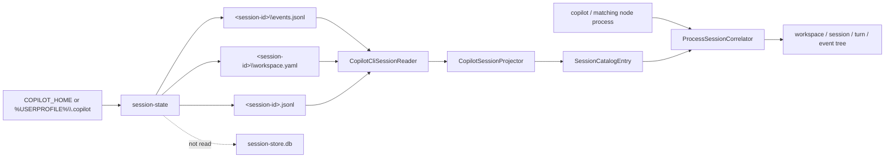
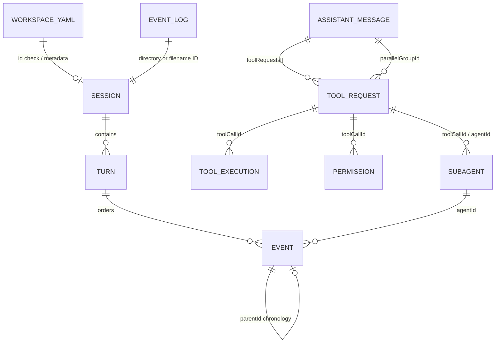
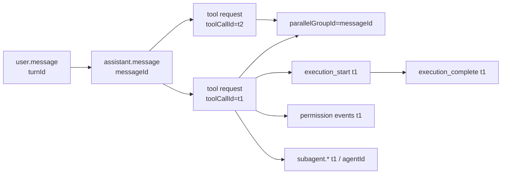
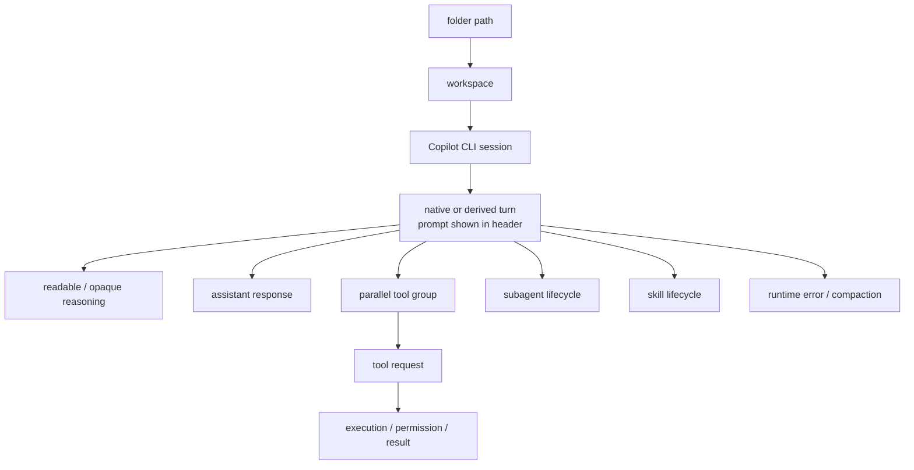

# SessionViewer: GitHub Copilot CLI sessions

Implementation snapshot: 2026-09-06.

This document describes the current GitHub Copilot CLI catalog used by
`SessionViewer`. The implemented source is the local Copilot CLI
`session-state` store. VS Code Copilot Chat, cloud agent tasks, GitHub-synced
history, `session-store.db`, and SDK-owned remote sessions are not cataloged.

The hook-side enrichment parser has a narrower contract:
[`Transcripts_Copilot.md`](../src/Transcripts_Copilot.md).
SessionViewer does not use `ObservationReconciler`; that class belongs to the
hook/transcript enrichment pipeline documented in
[`architecture.md`](../src/architecture.md#transcript-source-implemented).

## Current scope

One catalog entry is reconstructed from an `events.jsonl` stream plus optional
`workspace.yaml`. Current directory layout takes precedence over the legacy
flat file. Process command lines can enrich the final open/closed state.



## Configuration root and source locations

The default root is:

```text
%USERPROFILE%\.copilot
```

`COPILOT_HOME` replaces the complete root. SessionViewer strips surrounding
quotes, expands `%NAME%` variables with the discovery environment, and
supports `~`, `~/...`, and `~\...`.

| Source | Location | What it contributes |
|---|---|---|
| Current event stream | `session-state\<session-id>\events.jsonl` | Session lifecycle/context, prompts, turns, reasoning, assistant responses, tools, permissions, subagents, skills, usage, errors |
| Workspace metadata | `session-state\<session-id>\workspace.yaml` | ID check, CWD, Git root, repository, branch, title, client/host, creation/update times |
| Legacy event stream | `session-state\<session-id>.jsonl` | Same event processing without workspace YAML |
| Running process | `copilot` or `node` containing `@github/copilot`/`copilot-cli` | Resume/session ID, transcript path, CWD, and PID hints |

If both layouts exist for the same ID, only the current directory layout is
used. A current directory without `events.jsonl` is ignored.

The source does **not** read:

- `session-store.db`;
- `plan.md`;
- `checkpoints\`;
- `files\`;
- VS Code `chatSessions`;
- Copilot SDK APIs or cloud-agent endpoints.

The whole `session-state` root is watched recursively. `.jsonl` and
`workspace.yaml` changes trigger an affected-provider refresh after a 450 ms
debounce; a full recovery scan runs every 60 seconds by default. Harness
filtering happens only when projecting the merged catalog.

### Practical guidance

- Start SessionViewer with the same `COPILOT_HOME` environment as Copilot CLI.
- Event logs are opened with read/write/delete sharing and read to a
  snapshotted length. Appends after that length are picked up by the next
  watcher/timer refresh.
- A final unterminated malformed row is reported as an incomplete active-tail
  record, retained as raw provenance, and skipped semantically.
- Symbolic links and reparse points are not followed. Redirected session-state
  folders are outside the current security policy.
- Keep `workspace.yaml` with `events.jsonl`; it often supplies the best title
  and workspace even though events remain the conversation authority.
- Provider files are read-only. **Open Session** is a separate user action and
  can activate/resume the session.

## Effective safety limits

The SessionViewer host removes directory/file-count and overall scan-duration
caps. Per-session parsing remains bounded:

| Limit | Effective value | Copilot behavior |
|---|---:|---|
| Records per event log | 250,000 | Reading stops; result is incomplete |
| Event line size | 16 MiB | Row is skipped |
| Event file size | 2 GiB | Entire session event log is skipped |
| Workspace file size | min(2 GiB, `int.MaxValue`) | YAML is skipped |
| Workspace line size | 16 MiB | YAML is skipped |
| JSON nesting depth | 128 | Malformed/deep record is skipped |
| Warning count | 200 | Additional warnings are summarized |

Unlike Cursor/Claude JSONL, an oversized Copilot event file is not prefix-read.

## `workspace.yaml` format

The YAML root is deserialized as a mapping. Keys are matched
case-insensitively and aliases are accepted.

```yaml
id: copilot-session
cwd: C:\repo
git_root: C:\repo
repository: owner/repository
branch: main
name: Investigate failure
client_name: github/cli
host_type: terminal
created_at: 2026-09-05T08:00:00Z
updated_at: 2026-09-05T08:05:00Z
```

| Logical field | Accepted names | Use |
|---|---|---|
| Session ID | `id`, `session_id`, `sessionId` | Compared with directory/file identity; mismatch warns but does not replace it |
| CWD | `cwd`, `working_directory`, `workingDirectory` | Workspace fallback |
| Git root | `git_root`, `gitRoot` | Preferred workspace root |
| Repository | `repository`, `repository_name`, `repositoryName` | Metadata |
| Branch | `branch`, `git_branch`, `gitBranch` | Metadata |
| Title | `name`, `title` | Preferred session title |
| Client | `client_name`, `clientName` | Chooses Copilot app versus CLI opener |
| Host | `host_type`, `hostType` | Metadata |
| Created | `created_at`, `createdAt`, `creation_time` | Session start candidate |
| Updated | `updated_at`, `updatedAt`, `update_time` | Last-activity candidate |

Repository values may be scalar or a nested mapping containing
`full_name`/`fullName`/`name`/`slug`. Timestamps may be ISO strings or numeric
epoch values.

Every field is retained twice for compatibility: a short key such as `cwd`
and a `workspace.cwd` key.

## `events.jsonl` format

Each non-empty UTF-8 line is expected to be an object:

```json
{
  "type": "assistant.message",
  "id": "event-4",
  "timestamp": "2026-09-05T08:00:03Z",
  "parentId": "event-3",
  "agentId": "optional-agent",
  "ephemeral": false,
  "data": {
    "turnId": "turn-1"
  }
}
```

| Envelope field | Use |
|---|---|
| `type` | Native event family; missing becomes `unknown` with a warning |
| `id` | Native event identity; line-number fallback when absent |
| `timestamp` | ISO or numeric seconds/milliseconds/microseconds/nanoseconds |
| `parentId` | Previous/source record relationship only; never semantic tree nesting |
| `agentId` | Subagent attribution |
| `ephemeral` | Sets `SessionEventRecord.ExcludeFromSummary`; the current SessionViewer summary builder does not yet consume that marker |
| `data` | Event-specific object |

When `data` is absent or not an object, SessionViewer processes top-level
fields as data and records a warning. Every row, including unknown or malformed
rows, retains path, line, byte offset, raw content, record ID, parent ID, and
contract version in provenance.

### Implemented event families

| Event type/family | Main fields | Extraction |
|---|---|---|
| `session.start` | `sessionId`, `version`, producer/version, model/mode, context | Opens lifecycle segment; session metadata |
| `session.resume` | model/mode/context/resume time | Reopens lifecycle segment; increments resume count |
| `session.shutdown` | reason, model, final usage/model metrics | Closes lifecycle segment; final aggregate snapshot |
| `session.usage_checkpoint` | token/accounting trees | Cumulative session snapshot |
| `session.model_change`, `model_change` | model, cause/source | Current model metadata |
| `session.auto_mode_resolved`, `auto_mode_resolved` | chosen model/routing | Current model metadata |
| `session.mode_changed`, `session.mode_change` | mode | Current mode |
| `session.context_changed`, `session.context_change` | CWD/Git/repository/branch | Ordered context history and current context |
| `session.permissions_changed` | permission mode | Metadata |
| `user.message` | `turnId`, `interactionId`, content, `agentMode` | Prompt and turn binding |
| `system.message` | content/role, `skills[]` | Hidden message plus available-skill events |
| `assistant.turn_start` / `assistant.turn_end` | turn/interaction IDs | Durable turn boundaries |
| `assistant.reasoning` | readable content or opaque/encrypted value | Thought |
| `assistant.message` | content, model, phase, duration/usage, `toolRequests[]` | Response, optional thought, parallel tool requests |
| `tool.user_requested` | tool identity/arguments | Tool request |
| `tool.execution_start` | tool-call ID, arguments | Inner execution-start event |
| `tool.execution_complete` | result/status/error/duration | Tool success/failure |
| `permission.requested` | permission/tool/MCP identity | Permission request |
| `permission.completed`, `permission.denied` | result/status | Completion or denied event |
| `session.error` | error type/message | Runtime error |
| `subagent.*` | agent/tool/turn/task/model/duration | Subagent start/stop event |
| `skill.*` | name/path/stage | Typed skill lifecycle evidence |
| `model.*` | model/status/content/duration/usage | Model metadata or runtime error |
| type containing `compact` | status/reason | Compaction start/end |
| unknown | arbitrary | Counted and preserved as provenance; no event node |

## Extracted relationships



SessionViewer has no separate `Run` entity. Copilot's `turnId` (or a derived
interaction turn) becomes `SessionTurn`; `messageId` becomes
`AssistantStepId`; and `toolCallId` identifies each tool operation.

### Session identity and metadata

- Native and catalog identity comes from the current directory name or legacy
  filename. Catalog ID is
  `GitHubCopilot:CopilotCli:<native-session-id>`.
- `session.start.data.sessionId` and `workspace.yaml.id` are consistency
  checks. A mismatch is warned and preserved; it is not silently merged.
- Title precedence is `workspace.yaml` name, first prompt preview, then native
  ID.
- Workspace root precedence is:

```text
workspace.git_root > latest event gitRoot >
workspace.cwd > latest event cwd > Unknown workspace
```

- `session.context_*` records form numbered `context.<n>.*` metadata. The
  latest non-null fields also update `context.current.*`.
- Session start uses the earliest event/workspace creation time. Last activity
  uses the latest event/workspace update, then the snapshotted event-file
  modification time.

### Turn resolution

Copilot event versions do not always put `turnId` on every related record.
SessionViewer resolves a turn in this order:

1. an agent ID already mapped to its parent turn;
2. a known `toolCallId` and its request's turn;
3. native `turnId`;
4. a previously mapped `interactionId`;
5. the active turn for the same agent;
6. the most recent user-message turn for that agent;
7. a synthetic `interaction:<id>` or `<family>:<sequence>` turn when creation
   is allowed.

If a later record supplies a native `turnId`, an earlier synthetic
interaction-based turn is merged into it and every tool/agent mapping is
rewritten. Native turn evidence is `Observed`; synthetic binding is `Derived`.

`parentId` is retained as source chronology and is deliberately not used for
semantic nesting.

### Assistant steps, tools, and results



- `assistant.message.messageId`, then event ID, becomes `AssistantStepId`.
- More than one `toolRequests[]` member shares that step as
  `ParallelGroupId`; the WPF tree inserts one parallel group.
- `toolCallId` links the request, execution start/completion, permission, and
  related subagent evidence. Known tool name, MCP identity, assistant step,
  task, and start time are carried forward.
- Execution duration uses an explicit duration/latency field or the difference
  between start and completion timestamps.
- Completion failure is inferred from `success:false`, non-null `error`, or
  failure words in status. Abort/cancel fields set `IsAborted`.
- The tree nests non-request events below the nearest earlier tool request with
  the same `ToolCallId`.

### MCP and target paths

MCP server/tool identity is read from structured fields on the request,
execution, result, permission request, or nested approval. Flat hyphenated tool
names are never split. Structured MCP identity forces canonical
`ToolKind=Mcp`.

Target paths are recursively collected, up to 256 unique values and depth 8,
from properties such as `path`, `paths`, `file`, `filePath`, `targetPath`,
`dumpPath`, and `cwd`.

### Reasoning

- `assistant.reasoning.content`/`text`/`reasoningText` is readable,
  provider-exposed thought with `Observed` evidence.
- `assistant.message.reasoningText` becomes a separate observed thought.
- `reasoningOpaque` or `encryptedContent` becomes an `Opaque` thought with no
  fabricated text.
- Opaque content is not decrypted and should not be described as complete
  hidden chain-of-thought.

### Subagents and skills

- `subagent.*.start`/`.started` creates `SubagentStart`; other subagent event
  names create `SubagentStop`.
- `AgentId`, agent type/name, task, model, status, duration, and usage are
  retained when present.
- An agent ID is mapped to the parent turn so later agent-attributed events
  stay with that turn.
- `system.message.skills[]` produces `Available` skill evidence when the
  system row resolves to a turn. If a pre-turn system message is queued in
  `_pendingMainEvents`, only its hidden message event is attached to the first
  main turn; its `skills[]` array is currently dropped rather than deferred.
- `skill.available`, `skill.attached`, `skill.loaded`, and
  `skill.completed`/`skill.execution_completed` map to the corresponding
  explicit stage; other `skill.*` records mean `Invoked`.
- A path is retained as both skill source and target-path evidence.
- Nodes carrying skill evidence render in bold italic indigo in the tree, the
  shared cross-provider hint keyed on evidence presence rather than a stage.

### Usage and provider accounting

For assistant reasoning/message, subagent, and model handlers, event-level
extraction recursively preserves integral usage values from:

- known token, duration, latency, premium-request, and nano-AIU fields;
- `usage`;
- `tokenDetails` / `token_details`;
- nested `responseChunk.copilot_usage.token_details[]`.

Event measurements use `Request` scope, or `Turn` for subagent events, and
`Delta` behavior. Checkpoints use `Session` +
`CumulativeSnapshot`; shutdown uses `Session` + `FinalSnapshot`.

Final/checkpoint aggregates retain:

- input/output/cache/reasoning/total token families;
- duration and latency values;
- `modelMetrics` and `agentMetrics` numeric trees;
- `totalNanoAiu`;
- `totalPremiumRequests`;
- `totalApiDurationMs`.

Units remain `tokens`, `ms`, `nano-AIU`, `premium requests`, `requests`, or
`provider units`. SessionViewer does not convert provider accounting into USD.
A later `session.resume` clears stale final-shutdown aggregate keys before a
new lifecycle segment.

## Lifecycle and opening

`CopilotSessionProjector` first derives lifecycle from event order:

- the last `session.start`/`session.resume` after the last shutdown is `Open`;
- a last `session.shutdown` at or after the last open record is `Closed`;
- without lifecycle records, the source currently emits `Open` with `Derived`
  evidence when the log has records (`Unavailable` only for an empty log).

The shared coordinator then applies process correlation when the probe batch
contains at least one hint. An exact Copilot session/transcript match becomes
`Open`; a unique workspace/CWD match can become `Open` with `Heuristic`
evidence; unmatched sessions are forced to `Closed`, even when their event log
ends with `session.start` or `session.resume`.

Current implementation caveat: when **all** process probes return zero hints,
the correlator is not invoked and the event-tail lifecycle remains visible.
Therefore a log ending in `session.start` can appear open without current
process evidence. This differs from the otherwise conservative process-based
policy and should not be treated as proof that a terminal is still alive.

**Open Session** checks `client_name`:

- `github/autopilot` launches `ghapp://sessions/<id>`;
- otherwise it opens a terminal with `copilot --resume="<id>"`.

This is an activating operation; refresh/discovery remains passive.

## Tree projection



Session and turn dashboards derive wall time, abort state, tools, MCP calls,
thinking, compaction, usage, commands, target files, skills, and subagents from
the canonical events. Unknown source events remain in
`SessionCatalogEntry.Sources` but have no selectable event node and do not
affect these summaries. Prompt events supply the turn title and are
intentionally not repeated as child nodes.

## Plans

Copilot CLI has the strongest 1:1 plan binding because a plan lives inside its
session directory.

- The optional `session-state\<session-id>\plan.md` is read within the same file
  limits and safety checks as the event log. Its containing directory is the
  session identity, so the plan binds to that session as `Observed`
  (`CopilotSessionDirectory`).
- The native `plan` tool and any write targeting `plan.md` are surfaced as linked
  `Plan updated` activities under their turns. Copilot exposes no reliable full
  resulting body for these, so they are opaque evidence and the plan node shows a
  `partial` marker; the current `plan.md` supplies the authoritative latest body.
- The observed-update count is stateless and content-hash based over the plan
  body. A `plan.md` with no prior materialized body correctly shows
  `0 observed updates`.
- The plan turn remains unbound unless an event supplies an exact turn; the plan
  itself always binds to its session.

## Limitations and troubleshooting

- Copilot's event union evolves. Unknown types are preserved but not projected.
- Only top-level session directories and legacy top-level `.jsonl` files are
  discovered; arbitrary nested stores are ignored.
- `parentId` must not be used as a tool or subagent parent.
- Synthetic turn binding is deterministic but not native evidence.
- `ephemeral` records carry `ExcludeFromSummary`, but
  `SessionNodeSummaryBuilder` currently does not filter on that flag.
- Active writes can produce an incomplete tail or a snapshot shorter than the
  current file; the next refresh repairs it.
- A whole event log above 2 GiB is skipped.
- Workspace ID mismatch does not change the authoritative filename identity.
- `session-store.db` may know about sessions missing from the filesystem, but
  SessionViewer intentionally does not use it.
- VS Code, Copilot app, and cloud sessions are not inferred from CLI files,
  except the `github/autopilot` client hint used for opening a known local
  session ID.
- Raw system prompts, user messages, tool arguments/results, repository data,
  and identifiers can contain secrets.

Useful checks:

1. Confirm the effective `COPILOT_HOME`.
2. Verify the directory name, `workspace.yaml.id`, and
   `session.start.data.sessionId` agree.
3. Inspect `recordCount`, `malformedLineCount`, `eventCount.<type>`, and
   `contractVersion` metadata in the SessionViewer inspector.
4. Use the context history metadata to explain workspace/branch changes.
5. When a new event type is counted but absent from the tree, use its source
   path and the provider event log for inspection. The raw row remains in the
   catalog source model but has no event node.

## Implementation references

- `src/Shared/HarnessSpy.Core/Sessions/Copilot/CopilotCliSessionCatalogSource.cs`
- `src/Shared/HarnessSpy.Core/Sessions/Copilot/CopilotCliSessionReader.cs`
- `src/Shared/HarnessSpy.Core/Sessions/Copilot/CopilotPlanActivityExtractor.cs`
- `src/Shared/HarnessSpy.Core/Sessions/Plans/SessionPlanCatalogAssembler.cs`
- `src/Shared/HarnessSpy.Core/Sessions/Copilot/CopilotSessionProjector.cs`
- `src/Shared/HarnessSpy.Core/Sessions/Copilot/CopilotWorkspaceReader.cs`
- `src/Shared/HarnessSpy.Core/Sessions/Copilot/CopilotEventSemantics.cs`
- `src/Shared/HarnessSpy.Core/Sessions/Copilot/CopilotSessionInfrastructure.cs`
- `src/Shared/HarnessSpy.Core/Services/SessionCatalogCoordinator.cs`
- `src/Shared/HarnessSpy.Core/Services/SessionViewerSettingsService.cs`
- `src/Shared/HarnessSpy.Core/Sessions/Process/CommandLineSessionProbe.cs`
- `src/Shared/HarnessSpy.Core/Sessions/Process/ProcessSessionCorrelator.cs`
- `src/Shared/HarnessSpy.Wpf/SessionViewerApplicationHost.cs`
- `src/Shared/HarnessSpy.Wpf/ViewModels/SessionCatalogViewModel.cs`
- `src/Shared/HarnessSpy.Wpf/ViewModels/SessionTreeProjector.cs`
- `src/Shared/HarnessSpy.Wpf/ViewModels/SessionNodeSummaryBuilder.cs`
- `src/Tests/HarnessSpy.Tests/SessionCatalogSourceTests.cs`
