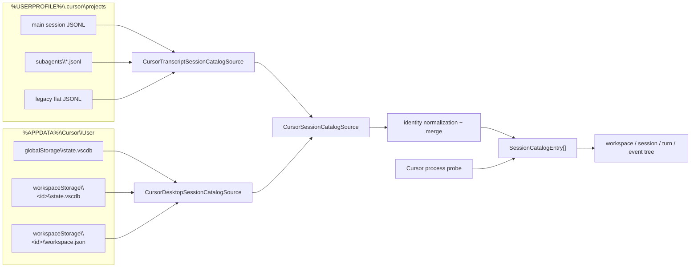
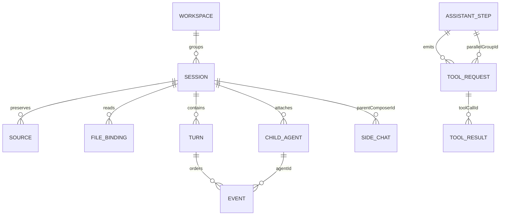
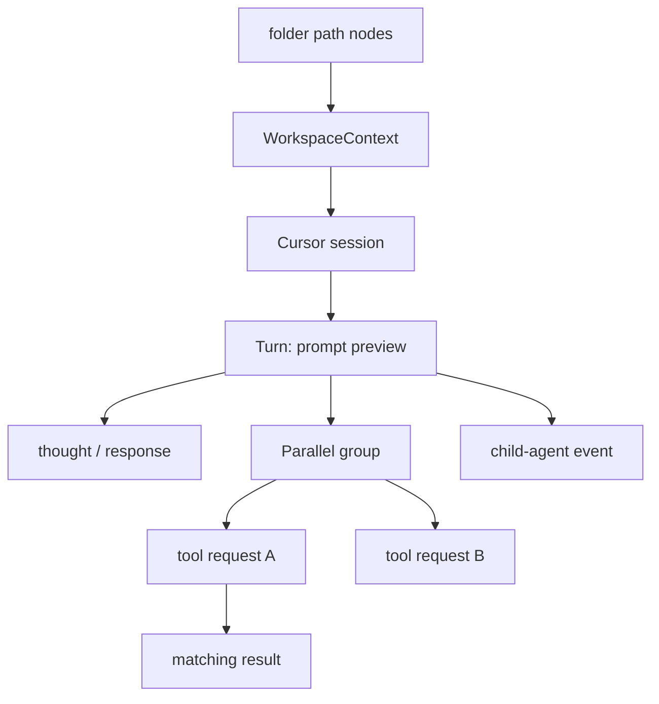

# SessionViewer: Cursor sessions

Implementation snapshot: 2026-09-06.

This document describes what the current `SessionViewer` implementation
actually reads and how it reconstructs Cursor sessions. It is intentionally
different from the hook-side transcript enrichment contract in
[`Transcripts_Cursor.md`](../src/Transcripts_Cursor.md): SessionViewer is a
passive, file-backed catalog and does not require Cursor hooks, HarnessSpy
payloads, the Cursor SDK, or a running Cursor session.
It also does not use `ObservationReconciler`, which belongs to the separate
hook/transcript enrichment pipeline documented in
[`architecture.md`](../src/architecture.md#transcript-source-implemented).

## Current scope

SessionViewer combines two independent Cursor sources:

1. provider-owned agent transcript JSONL;
2. Cursor Desktop's internal SQLite state.

Both are read concurrently and merged. Cursor Desktop, Cursor Agent CLI, and
background-agent transcripts can share IDs and layouts, so SessionViewer
currently reports all reconstructed entries as `HookSurface.CursorIde`.
Source provenance is the reliable way to tell how an entry was reconstructed;
the surface alone does not prove which Cursor executable produced it.



## Where SessionViewer gets Cursor sessions

| Source | Default location | What it contributes |
|---|---|---|
| Current main transcript | `%USERPROFILE%\.cursor\projects\<project>\agent-transcripts\<session>\<session>.jsonl` | Prompts, assistant text/thinking, tool requests/results when present, turn termination, optional model/mode/timestamps |
| Child transcript | `%USERPROFILE%\.cursor\projects\<project>\agent-transcripts\<parent>\subagents\<child>.jsonl` | Child-agent turns attached to the parent session |
| Legacy main transcript | `%USERPROFILE%\.cursor\projects\<project>\agent-transcripts\<session>.jsonl` | Same passive content as the current main layout |
| Global Desktop DB | `%APPDATA%\Cursor\User\globalStorage\state.vscdb` | Composer catalog, title, workspace, selection, relationships, conversation headers, bubble content |
| Workspace Desktop DB | `%APPDATA%\Cursor\User\workspaceStorage\<workspace-id>\state.vscdb` | Workspace-scoped copies of Composer metadata and bubbles |
| Workspace manifest | `%APPDATA%\Cursor\User\workspaceStorage\<workspace-id>\workspace.json` | Mapping from the opaque storage directory to a folder/workspace path |
| Running processes | Windows process inventory for `Cursor`, `cursor-agent`, and `agent` | Positive open-session hints from resume/session/path/CWD arguments; selected Desktop Composer corroboration |

SessionViewer watches `.jsonl`, `.vscdb`, `.vscdb-wal`, and `workspace.json`
changes below those roots. Notifications are recursive and debounced by 450 ms.
A recovery rescan runs every 60 seconds by default. A change refreshes only the
affected provider source; the coordinator retains cached Claude and Copilot
results.

The harness filter controls the projected tree, not discovery. Selecting only
Claude, for example, does not prevent Cursor files from being scanned and
cached.

### Source precedence and practical guidance

- The nested main transcript wins over a legacy flat transcript with the same
  project key and session ID.
- SQLite normally supplies the strongest title, workspace, timestamps, request
  IDs, relationships, and bubble detail. JSONL can recover content absent from
  SQLite.
- SQLite is opened with `ReadOnly`, private cache, no pooling, and a two-second
  command timeout. Leave Cursor's WAL beside `state.vscdb`; SQLite needs it to
  see the latest committed state. Do not copy only the main DB while Cursor is
  active.
- Files are opened with `FileShare.ReadWrite | FileShare.Delete`, so active
  transcripts can be inspected. A final partial line without a newline is
  accepted if it is complete JSON.
- Reparse points and symbolic links are not followed. If `.cursor` or Cursor's
  storage is redirected through a link, the current scanner intentionally
  skips it.
- SessionViewer only checks the standard current-user `%APPDATA%\Cursor\User`
  tree. Portable, Insiders, alternate user-data directories, remote machines,
  and cloud-agent stores are outside the current implementation.
- The encoded `<project>` directory is decoded only when its path segments
  exist. Otherwise SessionViewer searches transcript fields for rooted
  workspace paths; unresolved sessions go under `Unknown workspace`.

## Discovery and refresh behavior

`CursorSessionCatalogSource` starts the JSONL and Desktop scans in parallel.
The Desktop reader first publishes lightweight Composer skeletons, then
hydrates them with bubbles. Progress is coalesced on a 120 ms cadence. Parsed
transcript-only sessions are added before the final combined result.

SessionViewer displays partial batches only while the tree is initially empty.
After one final catalog has rendered, watcher, timer, and manual refreshes keep
the old tree until the new final batch is ready. Reconciliation uses stable
IDs, preserving expanded nodes and selection.

The SessionViewer host removes directory-count, file-count, and scan-duration
caps for completeness. The remaining safety bounds are:

| Limit | Effective value | Cursor behavior |
|---|---:|---|
| Records/bubbles per session | 250,000 | Remaining rows are skipped and the scan is marked incomplete |
| JSONL line size | 16 MiB | Oversized line is skipped |
| JSONL file prefix | 2 GiB | Only the prefix is read |
| SQLite JSON value | 16 MiB | Oversized Composer/header/bubble value is skipped |
| SQLite command timeout | 2 seconds | Database is marked incomplete on timeout/failure |
| Warning count | 200 | Additional warnings are summarized |

## Transcript JSONL format

The reader requires one JSON object per non-empty UTF-8 line. It tolerates a
UTF-8 BOM, trailing commas, JSON comments, property-name casing differences,
and a missing final newline.

### Row envelope

| Field | Accepted shapes | Use |
|---|---|---|
| `role` | `"user"` or `"assistant"` | Selects prompt versus assistant processing |
| `type` | notably `"turn_ended"` | Durable turn boundary; other unknown top-level types remain provenance only |
| `message` | object; absent means the row itself is used | Holds `content`, model, and mode |
| `message.content` | string or array | Text, thinking, tool calls/results, command output |
| `id`, `uuid`, `messageId` | optional string | Native provenance record ID |
| `parentId`, `parent_id` | optional string | Provenance chain only |
| `timestamp`, `createdAt`, `created_at`, `time` | ISO date or numeric epoch | Event time when available |
| `model`, `modelName`, `model_id` | optional string | Session/event model |
| `mode`, `unifiedMode`, `composerMode`, `composer_mode` | optional string | Session/event mode |

### `message.content[]`

| Block type | Important fields | Extracted result |
|---|---|---|
| `text` | `text` | User prompt, assistant response, or heuristic thought |
| `thinking` | `thinking` or `text` | Observed assistant thought when readable |
| `tool_use`, `tool-call` | `id`/`tool_use_id`/`toolCallId`, `name`, `input`/`arguments` | Tool request, canonical tool category, target paths, optional MCP identity |
| `tool_result`, `tool-result` | tool-call ID, name, `result`/`output`/`content`/`error`, `status`, `is_error` | Tool success/failure/message correlated by tool-call ID |
| `command_output` | `output`/`content`/`text` | Provider-specific output message |
| unknown | any | Preserved in raw row provenance but not projected as an event |

A typical sparse transcript is:

```json
{"role":"user","message":{"content":[{"type":"text","text":"<user_query>inspect the project</user_query>"}]}}
{"role":"assistant","message":{"content":[{"type":"thinking","thinking":"Inspect first."},{"type":"tool_use","id":"call-1","name":"Read","input":{"path":"README.md"}}]}}
{"role":"assistant","message":{"content":[{"type":"text","text":"Done."}]}}
{"type":"turn_ended","status":"success"}
```

The verified CursorSpy runtime fixture is sparser and contains only `text` and
`tool_use`. SessionViewer deliberately capability-detects the wider set above.

## Cursor Desktop SQLite format

The schema is internal and capability-probed at runtime. A database is useful
when it exposes at least one supported structure.

| Table / key | Required shape | Use |
|---|---|---|
| `cursorDiskKV` | `key`, `value` columns | `composerData:<composer-id>` and `bubbleId:<composer-id>:<bubble-id>` JSON values |
| `ItemTable` | `key`, `value` columns | `composer.composerHeaders` and `composer.composerData` aggregate JSON |
| `composerHeaders` | a `value` column; optional `composerId` | One header JSON object/array per row |

Supported aggregate containers are a JSON array, `allComposers[]`,
`composerHeaders[]`, `headers[]`, or a single Composer object.

### Composer/header object

| Field family | Meaning |
|---|---|
| `composerId`, `composer_id`, `id` | Native session identity |
| `name`, `title`, `subtitle` | Preferred session title |
| `createdAt`, `created_at`, `creationTime` | Session start candidate |
| `lastUpdatedAt`, `last_updated_at`, `updatedAt` | Last-activity candidate |
| `model*`, `modelDetails`, `modelInfo`, `modelConfig`, `selectedModel` | Model |
| `unifiedMode`, `mode`, `composerMode` | Mode |
| `workspaceIdentifier.id` | Opaque workspace-storage ID |
| `workspaceIdentifier.uri`, `workspacePath`, `cwd` | Workspace path |
| `isArchived`, `archived` | Archive metadata |
| `selectedComposerId`, `selectedComposerIds` | Currently selected Composer evidence |
| `subagentInfo.parentComposerId` | Parent Composer |
| `subagentInfo.subagentTypeName` | Child type, including `side-chat` |
| `subagentInfo.sideChatSeedTurnCount` | Number of inherited parent turns copied into a side chat |
| `fullConversationHeadersOnly[]`, `conversationHeaders[]`, `fullConversation[]`, `conversation[]` | Ordered bubble headers |

### Conversation header and bubble

| Field family | Meaning |
|---|---|
| `bubbleId`, `bubble_id`, `id` | Bubble identity and `cursorDiskKV` lookup suffix |
| `type`, `bubbleType`, `role` | User (`1`/`user`) or assistant (`2`/`assistant`/`ai`) |
| `requestId`, `generationId` | Exact turn key when present |
| `createdAt`, `timestamp`, `time`, `lastUpdatedAt` | Bubble chronology |
| `text`, `richText`, `thinking`, `content`, `message`, `output` | Recursively extracted content |
| `modelCallId`, `messageId` | Assistant-step identity |
| `allThinkingBlocks[]` | Explicit thought records |
| `isThought`, `bubbleType:"thought"` | Marks ordinary bubble content as thought |
| `toolFormerData` | Tool request/result object |

`toolFormerData` is inspected for native name, tool-call/model-call IDs,
arguments, status, result/error, model, duration, target paths, and structured
MCP server/tool identity.

### `workspace.json`

The manifest is a JSON object. `folder`, `workspace`, or `workspacePath` is
normalized into a local path. Its containing directory name is the opaque
workspace ID used to join Composer records that have an ID but no path.

## Extracted model and relationships



SessionViewer has no separate `Run` entity. A Cursor request/generation is
represented as `SessionTurn`; a model call inside that turn is represented by
`AssistantStepId`, and its tool calls share that step ID.

### Session identity and source merging

1. Desktop identity is always `composerId`; its catalog key is
   `cursor:<composerId>`.
2. Transcript identity starts from the filename/directory session ID. If the
   same native ID occurs in several project directories, the transcript key is
   scoped as `cursor:<id>:project:<stable-hash>`.
3. A transcript key is normalized to the Desktop key when native IDs match and
   either workspace keys match or the match is unambiguous on both sides.
4. `SessionCatalogMerger` merges only identical catalog keys. It unions files
   and provenance, chooses the richer event set, keeps the strongest lifecycle
   evidence, and merges turns/events by stable ID.
5. Cursor then consolidates transcript and SQLite turns with the same ordinal
   and normalized prompt. A request-ID-backed turn is preferred over an
   ordinal-only turn.

This conservative process avoids joining unrelated transcript files that reuse
a filename across projects.

### Workspace

Workspace evidence is chosen in this order:

1. explicit Composer workspace path;
2. Composer workspace ID joined to `workspace.json`;
3. the database directory's manifest;
4. decoded transcript project directory;
5. rooted paths discovered in transcript rows;
6. `No workspace` for `empty-window`, otherwise `Unknown workspace`.

Multiple transcript roots become one multiroot `WorkspaceContext`. Workspace
keys are case-insensitive normalized root sets.

### Session fields

| Catalog field | Cursor extraction |
|---|---|
| `NativeSessionId` | Composer ID or transcript session filename |
| `Title` | Desktop title, then first non-empty normalized prompt, then ID |
| `StartedAtUtc` | Earliest Composer creation or turn timestamp |
| `LastActivityAtUtc` | Latest Composer update, event time, or file write fallback |
| `Model` / `Mode` | Latest/richer Composer, bubble, or transcript value |
| `IsSelectedInHarness` | Selected Composer ID found in Desktop state |
| `Files` | Main/subagent JSONL, SQLite DB, and manifest bindings |
| `Sources` | Raw Composer/header/bubble/manifest/JSONL provenance |
| `Metadata` | Project/layout, DB keys, archive, selection, relationships, and fallback notes |

Important provider metadata keys are:

| Key / prefix | Meaning |
|---|---|
| `cursor.source` | `agent-transcript` or `desktop-sqlite` |
| `cursor.projectKey`, `cursor.layout`, `cursor.childTranscriptCount` | Transcript location/layout |
| `cursor.timestampProvenance` | File-write fallback was used |
| `cursor.databasePath`, `cursor.databaseKey`, `cursor.workspaceId` | Desktop storage identity |
| `cursor.selected`, `cursor.archived` | Composer UI state |
| `cursor.parentComposerId`, `cursor.subagentType`, `cursor.sideChatSeedTurnCount` | Direct relationship evidence |
| `cursor.child.<id>.*`, `cursor.backgroundChildCount` | Background children folded into this session |
| `cursor.sideChat.<id>.*`, `cursor.sideChatSkippedInheritedTurns` | Side-chat relationship and deduplication results |
| `process_id`, `process_name` | Process hint that established open state |

Empty Desktop “new chat” shells with no conversation headers or turns are
discarded. A transcript-only orphan with actual events is retained.

### Turns and events

- A transcript user row with non-empty text starts a turn; `<user_query>` tags
  are unwrapped when present.
- `turn_ended` ends the current turn. A new user row or EOF also closes it.
- SQLite uses `requestId`/`generationId` for an exact turn ID when available;
  otherwise it derives an ordinal turn ID.
- `SessionEventRecord.Order` preserves source order. Timestamp is optional and
  never replaces order.
- Assistant text in a transcript row containing tools is a `Heuristic` thought;
  text in a tool-free assistant row is a response. Explicit `thinking` and
  Desktop thought blocks are `Observed`.
- Every event retains its full source row/value plus path, line/offset or
  database key, record ID, and parent record ID.

### Tools, results, MCP, and parallel calls

- Tool requests and results join by `ToolCallId` when provided. In the tree, a
  result is nested under the nearest earlier request with that ID.
- Requests from the same assistant step are marked parallel when more than one
  is present. The tree inserts a `Parallel · N calls` group.
- Native tool names are preserved. `ToolClassifier` adds a canonical category
  such as `FileRead`, `Shell`, `Mcp`, or `Agent`.
- MCP identity comes from structured server/tool fields in the tool object or
  arguments. `CallDynamicTool` is treated as MCP; arbitrary hyphenated names
  are not split.
- Paths found in tool input are retained as `TargetPaths`, which drive the
  session/turn file summaries.

### Child agents and side chats

- A child JSONL file is attached to its parent transcript session. Its events
  carry `AgentId=<child filename>` and `AgentType=cursor-subagent`.
- Desktop background child Composers are folded into their parent. Their files
  are rebound as `Subagent`, their turns are appended, and child identity/type
  remains on events and metadata.
- Desktop `side-chat` Composers remain separate sessions. The configured seed
  turn count removes copied parent turns from the side chat.
- When both transcript and Desktop relationship evidence exist, inherited
  child/side-chat turns are removed again during final reconciliation to avoid
  duplicate history.
- Missing parents and relationship cycles produce warnings and keep the child
  as a recoverable standalone entry.

### Open/closed state and opening

Transcript and SQLite records initially produce `Closed`. The shared process
correlator changes a session to `Open` only when it finds:

1. an exact native session ID or transcript-path command-line hint;
2. for Cursor Desktop, a selected Composer plus a running `Cursor` process; or
3. a unique session in a workspace whose CWD matches a Cursor process hint.

The third case is explicitly `Heuristic`. File recency alone is never used.

For a Desktop session, **Open Session** executes
`cursor --reuse-window "<workspace>"`; Cursor has no supported local
conversation-ID opener, so this focuses the workspace, not necessarily the
conversation. A CLI resume path exists when metadata identifies a CLI
entrypoint, but current passive builders do not reliably provide that field.

## How the catalog appears in the tree



Session and turn dashboards derive turn count, wall time, tool/MCP/thought
counts, durations, skills, shell commands, target files, token measurements,
and subagent summaries from the canonical events. Cursor's passive sources
currently populate neither `UsageMeasurements` nor `SkillEvidence`, so token
and skill sections are absent. Prompt events supply the turn title and are
intentionally not repeated as child nodes.

Although events expose `ExcludeFromSummary`, the current
`SessionNodeSummaryBuilder` does not inspect that flag; summary membership is
determined by canonical role/tool-kind checks.

## Plans

SessionViewer discovers Cursor plan files and binds them to the session that
created them.

- Plan files are scanned from `%USERPROFILE%\.cursor\plans\*.plan.md`. Each file
  is parsed as YAML front matter (`name`, `overview`, `todos`, `isProject`) plus
  a markdown body. Workspace-local plan directories are capability-gated until an
  observed `isProject: true` artifact proves that layout.
- The transcript `CreatePlan` tool call is the creation evidence. A plan file is
  bound to a session when the file and exactly one `CreatePlan` call produce the
  same normalized structured key (`name` + `overview` + todo `id`/`content`
  pairs). Todo `status` is ignored because `CreatePlan` never carries one, so a
  plan whose todos were later completed still matches. This binding is
  `Corroborated`; the containing turn is `Derived` because Cursor transcripts
  have no native generation ID.
- An explicit `.plan.md` path found in a file tool or an `ApplyPatch` body is a
  stronger `ExplicitPlanPath` (`Observed`) binding. A plan read (not written) by
  another session is a reference and never establishes ownership.
- If two sessions match the same plan, the plan stays an orphan
  (`Ambiguous`) rather than being guessed onto one of them.
- The observed-update count is stateless: it is the number of distinct
  normalized plan-body contents after creation, recomputed on every scan.
  `CreatePlan` supplies the initial body; the current file supplies the latest.
  Cursor `ApplyPatch` edits expose only a diff, so they are counted as opaque
  evidence and surface as a `partial` marker rather than an exact count. Only the
  plan body participates in the count; front-matter todo-status changes do not.
- Bound plans appear directly under their session (before its turns), and the
  `CreatePlan`/plan-edit event is rendered as a linked `Plan created`/`Plan
  updated` node instead of a duplicate tool node. Unbound plans appear under the
  top-level **Orphan Plans** root, grouped by provider then workspace.

## Limitations and troubleshooting

- Cursor's SQLite and transcript schemas are internal and version-sensitive.
  Unknown JSON is retained in provenance, but unsupported shapes may not
  produce visible events.
- The transcript project-key encoding is ambiguous when directory names
  contain hyphens; decoding succeeds only by testing existing path segments.
- A sparse JSONL can lack timestamps, IDs, model, mode, tool results, and usage.
  File modification time is only a last-activity fallback.
- Child JSONL discovery is one level below `subagents`; deeper nested
  directories are not recursively scanned by the Cursor source.
- Duplicate native IDs that cannot be corroborated by workspace stay separate.
- SQLite values larger than 16 MiB are intentionally skipped even though the
  database itself may be larger.
- Process command lines often omit Desktop conversation IDs. Open state is
  therefore conservative except for selected-Composer corroboration.
- Raw provenance can contain prompts, source code, command output, absolute
  paths, and secrets. Treat exports as sensitive.

Useful checks:

1. Confirm `%USERPROFILE%\.cursor\projects` and
   `%APPDATA%\Cursor\User` belong to the Windows account running SessionViewer.
2. Keep `state.vscdb`, `state.vscdb-wal`, and `state.vscdb-shm` together while
   diagnosing missing current data.
3. Inspect the warning panel for unreadable/reparse-point paths, malformed
   JSON, or SQLite schema changes. The UI suppresses warning text containing
   `oversized`; an incomplete-status message can therefore be the only visible
   sign that a large SQLite value was skipped.
4. Use the inspector's **Provenance** and **Raw source** tabs to determine
   whether a field came from JSONL, a Composer object, a bubble, or a manifest.
5. Use manual **Refresh** after copying an offline DB snapshot; file watchers
   cannot observe a root that did not exist when watching started.

## Implementation references

- `src/Shared/HarnessSpy.Core/Sessions/Cursor/CursorSessionCatalogSource.cs`
- `src/Shared/HarnessSpy.Core/Sessions/Cursor/CursorPlanCatalogSource.cs`
- `src/Shared/HarnessSpy.Core/Sessions/Cursor/CursorPlanActivityExtractor.cs`
- `src/Shared/HarnessSpy.Core/Sessions/Cursor/CursorPlanDocument.cs`
- `src/Shared/HarnessSpy.Core/Sessions/Plans/SessionPlanCatalogAssembler.cs`
- `src/Shared/HarnessSpy.Core/Sessions/Cursor/CursorTranscriptSessionCatalogSource.cs`
- `src/Shared/HarnessSpy.Core/Sessions/Cursor/CursorTranscriptFileReader.cs`
- `src/Shared/HarnessSpy.Core/Sessions/Cursor/CursorTranscriptParser.cs`
- `src/Shared/HarnessSpy.Core/Sessions/Cursor/CursorDesktopSessionCatalogSource.cs`
- `src/Shared/HarnessSpy.Core/Sessions/Cursor/CursorDesktopSqliteReader.cs`
- `src/Shared/HarnessSpy.Core/Sessions/Cursor/CursorDesktopBubbleProjector.cs`
- `src/Shared/HarnessSpy.Core/Sessions/Cursor/CursorDesktopSessionBuilder.cs`
- `src/Shared/HarnessSpy.Core/Services/SessionCatalogCoordinator.cs`
- `src/Shared/HarnessSpy.Core/Services/SessionViewerSettingsService.cs`
- `src/Shared/HarnessSpy.Core/Sessions/SessionCatalogMerger.cs`
- `src/Shared/HarnessSpy.Core/Sessions/Process/ProcessSessionCorrelator.cs`
- `src/Shared/HarnessSpy.Wpf/SessionViewerApplicationHost.cs`
- `src/Shared/HarnessSpy.Wpf/ViewModels/SessionCatalogViewModel.cs`
- `src/Shared/HarnessSpy.Wpf/ViewModels/SessionTreeProjector.cs`
- `src/Shared/HarnessSpy.Wpf/ViewModels/SessionNodeSummaryBuilder.cs`
- `src/Tests/HarnessSpy.Tests/SessionCatalogSourceTests.cs`
