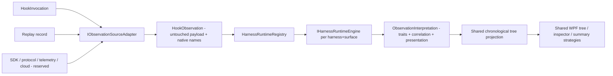

# HarnessSpy architecture

This document describes the native, source-agnostic runtime architecture and the
version-aware follow-up blueprints for Copilot's higher-fidelity sources and for
a future CodexSpy. Record the retrieval date and the tested runtime/schema
versions beside the pinned references, because several Copilot and Codex
contracts are Preview or version-skewed.

## Fixed design constraints

- Display and persist each provider's exact native hook and tool names. Never
  rename `Bash`/`PowerShell` to `Shell`, `Edit` to `Write`, or Claude events to
  Cursor names.
- Keep semantic traits (scope, direction, category, correlation role, summary
  contribution) as derived sidecar metadata only; they never become identity.
- Shared storage, replay, chronological insertion, correlation primitives, tree,
  inspector, and summary rendering are provider-neutral.
- Provider decisions live in per-harness/per-surface runtime engines: Cursor,
  Claude, Copilot CLI, VS Code Local, and an unknown/future fallback.
- Execution surface, payload dialect, observation source, and contract version
  are independent dimensions. Copilot CLI can emit either camelCase CLI payloads
  or PascalCase/snake_case VS Code-compatible payloads.
- Do not infer a runtime from casing alone. Explicit configuration metadata
  (`HARNESS_SPY_RUNTIME_ID`) is authoritative; payload heuristics are a fallback
  with an explicit confidence level.
- Hook invocation, SDK callback, protocol stream, telemetry, cloud API, replay,
  and synthetic observations stay distinct even when they describe one action.

## Runtime/source pipeline

## Core contracts

- `HarnessIds` / `SurfaceIds` / `DialectIds`: stable string-backed identities.
- `HookObservation`: the source-agnostic observation. Stores the untouched
  payload, the exact native event/tool names, native timestamp when present,
  capture time, ingestion ordinal, effective timestamp, and the interpretation.
- `ObservationInterpretation`: the provider-neutral traits produced by the owning
  engine — scope, role, direction, tone, correlation ids and match strategy,
  curated field specs, header detail, hover text, and summary flags.
- `IObservationSourceAdapter`: converts a hook envelope / replay record (and, in
  future, SDK / protocol / telemetry / cloud records) into a `HookObservation`
  without normalizing names. `HookInvocationSourceAdapter` and
  `ReplaySourceAdapter` are implemented; SDK/protocol/telemetry/cloud adapters
  are reserved as marker interfaces.
- `IHarnessRuntimeEngine` + `HarnessRuntimeRegistry`: select and run the engine
  for `(harness, surface, dialect)`. `UnknownRuntimeEngine` displays any
  unrecognised provider/event chronologically with its raw fields.
- Shared correlation primitives: scoped tool-call pairing, order-insensitive
  structural input comparison used only as evidence, unique-best candidate
  selection, chronological insertion, duration computation, and parallel-wave
  maintenance (`ToolCorrelationMatcher`, `MainWindowViewModel`).

## Chronological placement

Every direct child is inserted by `(EffectiveTimestamp, IngestionOrdinal,
EventId)`. `EffectiveTimestamp` is the provider's native timestamp when the
payload carries one (Copilot CLI epoch milliseconds, VS Code ISO-8601) and the
HarnessSpy capture time otherwise. Late-arriving events are reinserted at the
correct position; container nodes (turns, parallel waves) sort by their earliest
descendant. Causal/protocol links and semantic parentage are kept separate from
chronological order.

## Per-harness engines

- Cursor: native names already match the shared vocabulary; behaviour and
  appearance are unchanged from the pre-refactor viewer.
- Claude: `session_id` is the session key, `prompt_id` the exact turn key;
  events without `prompt_id` stay session-scoped. Tools pair by scoped
  `tool_use_id`; permissions attach by `tool_use_id`; subagents scope by
  `agent_id`; batches use `PostToolBatch.tool_calls`. Requires Claude Code
  `2.1.196+`.
- Copilot CLI: the configured event key is the native identity; native tool
  names are preserved; turns are derived (`userPromptSubmitted`..`agentStop`)
  with `userPromptTransformed` nested under its `userPromptSubmitted`. There is
  no `tool_use_id`, so `postToolUse`/`postToolUseFailure` pair to their
  `preToolUse` by tool name and canonical `toolArgs`, falling back to arrival
  order; subagents correlate heuristically by name. Ordering uses the epoch
  timestamp, but `sessionStart`/`sessionEnd` are pinned to the session's first
  and last positions because the CLI emits `sessionStart` after the first
  prompt. Permission prompts (`notification`/`permissionRequest`) are toned
  distinctly.
- VS Code Local: eight Preview events with exact `tool_use_id`/`agent_id` and ISO
  ordering; native tool names such as `editFiles` are preserved.

## Profiles

- Claude Safe (28 events) and Full (32 events) are generated from
  `ClaudeHookCatalog`; neither registers `WorktreeCreate`. Full adds
  `MessageDisplay`, `FileChanged`, `Elicitation`, `ElicitationResult`.
- Copilot CLI v1 registers 14 events; VS Code Local has its own eight-event
  catalog.
- Generators (`ClaudeSettingsGenerator`, `CopilotSettingsGenerator`, exposed via
  each hook's `--generate-settings` mode) stamp the real executable path so the
  repository ships only a placeholder.

## Privacy and transport

- Only an explicit allowlist of environment variables is captured
  (`CURSOR_VERSION`, `CLAUDE_CODE_*`, `COPILOT_HOME`, `HARNESS_SPY_*`); arbitrary
  variables are never read.
- Named Pipe is the only implemented live transport. Source kinds are reserved
  for `HookInvocation`, `Sdk`, `ProtocolStream`, `OpenTelemetry`, `CloudApi`,
  `Replay`, and `Synthetic`.
- High-volume payloads (MessageDisplay, elicitation) are capped in the inspector
  so the UI stays responsive while the raw payload remains visible.
- Each hook envelope also carries the best-effort PID/name of the process that
  spawned the hook console app (`SpawningProcessId`/`SpawningProcessName`,
  resolved via `NtQueryInformationProcess`), alongside the environment
  allowlist above.

## Follow-up: Copilot observation sources (not implemented)

Reserve explicit surface/source ids for these; record contracts and order.

### Copilot SDK callbacks and streaming events

- SDK sessions are owned programmatically, not attached to an arbitrary CLI
  session.
- Lifecycle callbacks: `onSessionStart`, `onSessionEnd`, `onUserPromptSubmitted`,
  `onUserPromptTransformed`, `onPreToolUse`, `onPreMcpToolCall`, `onPostToolUse`,
  `onPostToolUseFailure`, `onErrorOccurred`, `onAgentStop`; keep
  `onPermissionRequest` and other input handlers separate.
- Streaming envelope (independent of callbacks): event `id`, timestamp,
  previous-event `parentId`, optional subagent `agentId`, optional `ephemeral`,
  event `type`, typed `data`. Treat `parentId` as previous-event linkage, not
  semantic parentage. Use `session.idle` as processing-complete and keep
  `session.task_complete` as a separate best-effort signal. Pin the SDK/schema
  version; do not freeze the open event union into a closed enum.

### Copilot OpenTelemetry

- Preferred passive enrichment for existing CLI/VS Code activity when exact
  traces/ids are required. Preserve trace/span ids, conversation id, turn and
  interaction ids, tool-call id, response id, and hook-invocation id separately.
- Content capture is opt-in. OTel may arrive out of order and must not become the
  sole chronological tree source.

### Copilot ACP and cloud agent

- ACP is a Preview long-lived NDJSON protocol over stdio/TCP; model it as
  `ProtocolStream` and retain ACP session ids, permission requests, session
  updates, available-command snapshots, usage, and stop reasons. Do not interpret
  ACP frames as config-hook invocations.
- Cloud hooks run in an ephemeral Linux sandbox with a reduced event set, no
  useful interactive permission flow, restricted network, and no durable local
  files. A later cloud collector needs a Linux forwarder, authenticated HTTPS
  endpoint, firewall allowlisting, replay protection, and tenant/session
  provenance. Keep cloud task APIs/audit logs as separate polling/audit sources.

Recommended order: SDK stream ingestion, then OTel enrichment with
provenance-based deduplication, then ACP when an ACP-hosting use case exists,
then cloud relay/polling with an explicit deployment and security design.

## Follow-up: CodexSpy blueprint (not implemented)

Use `HarnessId = openai-codex`. Treat Codex CLI/local hooks, app-server, exec/SDK
stream, telemetry, and cloud tasks as separate surfaces/sources. A hook payload
generally cannot prove whether local Codex was hosted by CLI, IDE, or Desktop:
identify it as Codex Local unless authoritative transport metadata says
otherwise. Keep every source's native event, method, item, and tool names.

### Source A: passive Codex local lifecycle hooks

The 11 documented events: `SessionStart`, `SessionEnd`, `UserPromptSubmit`,
`PreToolUse`, `PermissionRequest`, `PostToolUse`, `PreCompact`, `PostCompact`,
`SubagentStart`, `SubagentStop`, `Stop`. Document `Interrupt` separately as
release/schema-supported but not yet in the public guide; enable it only through
runtime-version capability detection.

Configuration/trust: user/project `hooks.json`, inline `[hooks]` in
`config.toml`, plugin hooks, and managed hooks are separate sources. Project and
plugin command hooks are skipped until their exact current hash is reviewed and
trusted; never bypass or modify trust hashes automatically. Use command handlers
with `commandWindows` for Windows overrides; preserve source path, matcher,
timeout, status message, and trust state. Most hooks default to a long timeout,
while `SessionEnd` defaults to one second (max three); set explicit short passive
timeouts. General asynchronous command hooks are not currently supported even
though the field is parsed.

Native fields: common `session_id`, `transcript_path`, `cwd`, `hook_event_name`,
`model`; turn-scoped `turn_id`; `permission_mode`; tool lifecycle `tool_name`,
`tool_use_id`, `tool_input`, `tool_response`; subagents `agent_id`, `agent_type`,
`agent_transcript_path`, `stop_hook_active`, `last_assistant_message`;
compaction `trigger`; stop `stop_hook_active`, `last_assistant_message`. The hook
payload has no documented timestamp, so projection normally uses capture time and
ingestion ordinal.

Behavioural constraints: preserve emitted names such as `Bash`, `apply_patch`,
and `mcp__server__tool` (matcher aliases like `Edit`/`Write` are not payload
identity). Hooks do not cover hosted tools such as `WebSearch`; specialized tool
paths may opt out. `PermissionRequest` has no documented `tool_use_id`; correlate
by turn, tool, and input evidence, retaining ambiguity. `PostToolUse` also
represents non-zero Bash exits; there is no separate documented failure hook.
`SessionEnd` is advisory and may occur after 30 minutes without a client. Passive
output is empty stdout and exit zero. Pin the Codex runtime and generated hook
schemas because the guide and released schema can differ.

### Source B: Codex app-server and Python SDK (recommended high fidelity)

Long-lived JSON-RPC/JSONL transport, not `HookForwarder`. Initialize capability
negotiation and generate bindings from the installed version. Preserve
`thread.id`, `thread.sessionId`, fork/parent thread ids, `turn.id`, item id,
hook-run id, request/approval id, and client user-message id separately. Ingest
`thread/started`, thread status/history notifications, `turn/started`,
`turn/completed`, `item/started`, `item/completed`, item deltas, `hook/started`,
`hook/completed`, and `thread/tokenUsage/updated`. Model app-server items
natively (messages, reasoning, plans, command execution, file changes,
MCP/dynamic/collaboration tool calls, web search, images, review mode, context
compaction). Treat final `item/completed` state as authoritative; deltas update
presentation only. Handle server approval/input/permission/dynamic-tool/MCP
elicitation requests by request id without auto-approving. Use `threadId`,
`turnId`, `itemId` as exact scope; do not treat JSON-RPC request ids or
chronological links as semantic parents. Preserve unknown notifications/items.

### Source C: supplementary Codex sources

- `codex exec --json` and the TypeScript SDK expose a simpler JSONL sequence
  (`thread.started`, turn start/completion/failure, item start/update/completion,
  error); use only for managed exec sessions and retain stream context.
- Legacy `notify` emits only `agent-turn-complete`; treat as a notification
  source, not lifecycle coverage.
- OpenTelemetry provides conversation/tool ids, decisions/results, durations,
  tokens, model, and environment data as batched analytics; reconcile with live
  observations via source ids and traces, not as the ordered tree source.
- Codex cloud offers polling and GitHub-visible artifacts, not a documented
  lifecycle push stream. Model cloud task id/status/diff as a separate polling
  surface; do not manufacture local hook events.

### CodexSpy delivery sequence and acceptance

1. Pin a Codex release and capture real fixtures for every supported hook.
2. Implement passive local hook collection and a Codex Local runtime engine.
3. Approve every Codex node/table field before presentation work.
4. Implement the app-server source adapter and managed-session provider.
5. Add exact thread/turn/item/approval projection and Codex summaries.
6. Optionally add exec JSONL, telemetry enrichment, and cloud polling.
7. Add provenance-based reconciliation when one action is observed by more than
   one source.

Acceptance: exact native hook/method/item/tool names preserved; hook and
app-server sources coexist without duplicate summary counts; app-server ids
provide exact thread/turn/item relationships; unknown versioned events remain
visible; adding CodexSpy requires no shared WPF event-name branches.

## Pinned references

Copilot:

- [GitHub Copilot hooks reference](https://docs.github.com/en/copilot/reference/hooks-reference)
- [VS Code agent hooks reference](https://code.visualstudio.com/docs/agents/reference/hooks-reference)
- [GitHub Copilot SDK hooks](https://docs.github.com/en/copilot/how-tos/copilot-sdk/features/hooks)
- [GitHub Copilot SDK streaming events](https://docs.github.com/en/copilot/how-tos/copilot-sdk/features/streaming-events)
- [Copilot CLI ACP server](https://docs.github.com/en/copilot/reference/copilot-cli-reference/acp-server)
- [Copilot CLI OpenTelemetry reference](https://docs.github.com/en/copilot/reference/copilot-cli-reference/cli-command-reference#opentelemetry-monitoring)

Codex:

- [Codex lifecycle hooks](https://developers.openai.com/codex/hooks)
- [Codex app-server protocol](https://developers.openai.com/codex/app-server)
- [Codex SDK](https://developers.openai.com/codex/sdk)
- [Codex advanced configuration, notify, and telemetry](https://developers.openai.com/codex/config-advanced)
- [Codex cloud](https://developers.openai.com/codex/cloud)
